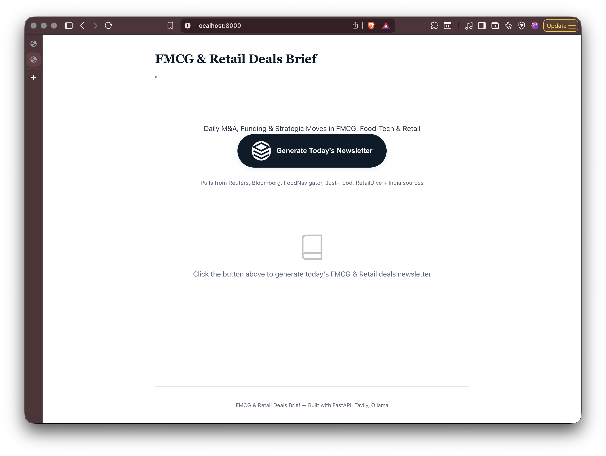
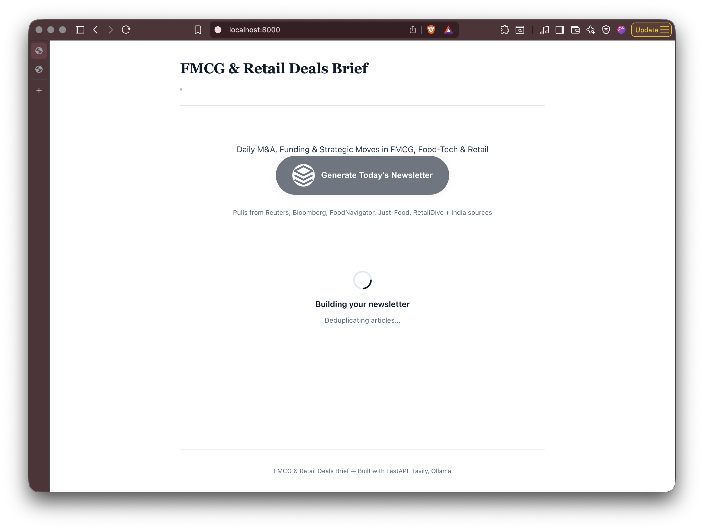
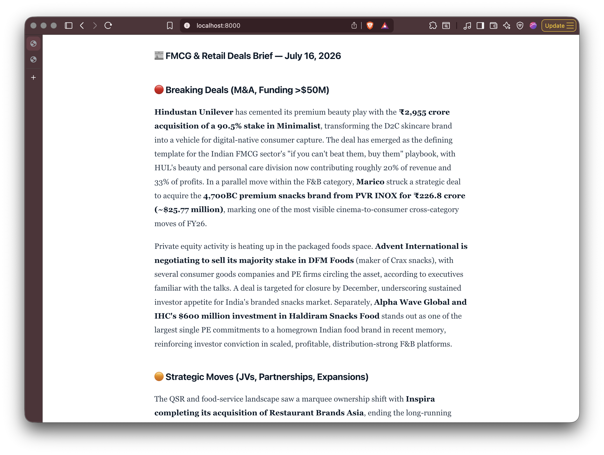

# 📰 FMCG & Retail Deals Brief

A daily newsletter generator that fetches the latest FMCG & retail deal news, filters for relevance, scores source credibility, and generates a structured business brief using AI.

## 📸 Screenshots

| Home Page | Generating | Output |
|-----------|-----------|--------|
|  |  |  |

## 🏗 Architecture

```
┌──────────────────────────────────────────────────────────────────────────┐
│                         FMCG & Retail Deals Brief                        │
│                      FastAPI + Ollama + Tavily API                       │
└──────────────────────────────────────────────────────────────────────────┘

┌──────────────────────────────────────────────────────────────────────────┐
│  LAYER 1: USER INTERFACE (Frontend)                                     │
│                                                                          │
│  ┌─────────────┐  ┌─────────────┐  ┌─────────────┐  ┌───────────────┐  │
│  │ index.html  │  │ style.css   │  │  app.js     │  │ public/       │  │
│  │ (Jinja2)    │  │ Dark/Light  │  │ Markdown →  │  │ Screenshots   │  │
│  │             │  │ Theme       │  │ HTML Render │  │               │  │
│  └─────────────┘  └─────────────┘  └─────────────┘  └───────────────┘  │
│                          │                                              │
│                    GET /, GET /static/*                                 │
└──────────────────────────┼───────────────────────────────────────────────┘
                           ▼
┌──────────────────────────────────────────────────────────────────────────┐
│  LAYER 2: API LAYER (FastAPI)                                           │
│                                                                          │
│  ┌─────────────┐  ┌──────────────────┐  ┌───────────────┐              │
│  │  main.py    │  │  endpoints.py    │  │  models.py    │              │
│  │  App Init   │  │  POST /generate  │  │  Pydantic     │              │
│  │  Mount      │  │  GET  /status    │  │  Schemas      │              │
│  │  Static     │  │                  │  │               │              │
│  └─────────────┘  └──────────────────┘  └───────────────┘              │
│                          │                                              │
│              run_in_threadpool(run_pipeline)                            │
└──────────────────────────┼───────────────────────────────────────────────┘
                           ▼
┌──────────────────────────────────────────────────────────────────────────┐
│  LAYER 3: PIPELINE (api/pipeline.py)                                    │
│                                                                          │
│    ┌──────┐   ┌──────┐   ┌──────┐   ┌──────┐   ┌──────┐   ┌──────┐   │
│    │  1.  │   │  2.  │   │  3.  │   │  4.  │   │  5.  │   │  6.  │   │
│    │Query │──▶│Search│──▶│Dedup │──▶│Rel.  │──▶│Cred. │──▶│Output│   │
│    │Gen.  │   │      │   │(LLM) │   │(LLM) │   │(LLM) │   │(LLM) │   │
│    └──────┘   └──────┘   └──────┘   └──────┘   └──────┘   └──────┘   │
└──────────┬──────────┬──────────┬──────────┬──────────┬───────┬──────────┘
           │          │          │          │          │       │
           ▼          ▼          ▼          ▼          ▼       ▼
┌──────────────────────────────────────────────────────────────────────────┐
│  LAYER 4: EXTERNAL SERVICES                                              │
│                                                                          │
│  ┌────────────────────────────────┐  ┌───────────────────────────────┐  │
│  │  Tavily API                    │  │  Ollama (Local LLM)           │  │
│  │  websearch/tavilyAPI.py        │  │  LLM/ollama.py               │  │
│  │  Domains: Reuters, Bloomberg,  │  │  Model: minimax-m3:cloud     │  │
│  │  Economic Times, BS, MC, FSSAI │  │  http://localhost:11434      │  │
│  └────────────────────────────────┘  └───────────────────────────────┘  │
│                                                                          │
│  ┌────────────────────────────────┐  ┌───────────────────────────────┐  │
│  │  LLM Prompts                   │  │  .env Configuration           │  │
│  │  LLM/prompt.py (orchestrator)  │  │  TAVILY_API_KEY               │  │
│  │  checkpoints/*.py (prompts)    │  │  OLLAMA_HOST                  │  │
│  └────────────────────────────────┘  │  OLLAMA_MODEL                 │  │
│                                       └───────────────────────────────┘  │
└──────────────────────────────────────────────────────────────────────────┘
```

## 🧠 Process Flow

```
User clicks "Generate"
        │
        ▼
┌─────────────────────┐
│  FastAPI receives   │
│  POST /api/generate │
│  with topic, region │
│  and date           │
└──────────┬──────────┘
           │
           ▼
┌────────────────────────────────────────────────────────────────────────┐
│  PIPELINE: run_pipeline(topic, region, date)                          │
│                                                                        │
│  Step 1 — Query Generation                                            │
│  ├── websearch/prompt.py generates 6 search queries                   │
│  ├── + 4 breaking news queries                                        │
│  └── Queries include keywords for FMCG M&A, funding, deals            │
│                                                                        │
│  Step 2 — Search Articles                                              │
│  ├── Each query sent to Tavily API                                     │
│  ├── Searches trusted domains (Reuters, ET, BS, etc.)                  │
│  └── Raw articles collected with title, URL, content, score            │
│                                                                        │
│  Step 3 — Deduplication (LLM)                                          │
│  ├── checkpoints/duplicates.py prompt                                  │
│  └── LLM removes duplicate/near-duplicate articles                     │
│                                                                        │
│  Step 4 — Relevance Filtering (LLM)                                    │
│  ├── checkpoints/relevance_fmcg_deals.py prompt                        │
│  └── LLM scores & keeps only FMCG deal-relevant articles (≥50)        │
│                                                                        │
│  Step 5 — Credibility Scoring (LLM)                                    │
│  ├── checkpoints/credibility.py prompt                                 │
│  ├── LLM scores each source 0-100 based on tier + penalties/bonuses   │
│  └── Flags attached for low-credibility items                          │
│                                                                        │
│  Step 6 — Output Generation (LLM)                                      │
│  ├── checkpoints/output_structured.py prompt                           │
│  ├── LLM writes article-style newsletter with paragraphs               │
│  └── Returns Markdown with **bold** for company names & numbers        │
│                                                                        │
└──────────────────────────┬─────────────────────────────────────────────┘
                           │
                           ▼
┌────────────────────────────────────────────────────────────────────────┐
│  FRONTEND RENDERING                                                     │
│                                                                         │
│  1. FastAPI returns markdown in JSON: {success: true, html: "..."}     │
│  2. static/app.js receives the response                                │
│  3. renderMarkdown() converts:                                         │
│     - ## / ### headings → <h3> (big, bold section titles)             │
│     - **bold** → <strong> (company names, deal values)                │
│     - *italic* → <em>                                                  │
│     - Paragraphs → <p> with proper line-height                         │
│  4. Rendered HTML injected into #newsletter-content                    │
│  5. Newsletter container shown with fade-in animation                  │
│                                                                         │
└────────────────────────────────────────────────────────────────────────┘
```

## 📁 Project Structure

```
FMCG-newsletter/
├── main.py                          # FastAPI app entry point
├── requirements.txt                 # Python dependencies
├── .env                             # Environment variables
├── .gitignore
├── .dockerignore                    # Docker build context exclusions
├── Dockerfile                       # Docker image definition
├── docker-compose.yml               # Docker services orchestration
│
├── api/                             # API Layer
│   ├── endpoints.py                 # POST /api/generate, GET /api/status
│   ├── models.py                    # Pydantic request/response models
│   └── pipeline.py                  # run_pipeline() - orchestrates full flow
│
├── websearch/                       # Web Search Layer
│   ├── tavilyAPI.py                 # Tavily API client wrapper
│   └── prompt.py                    # Query generation, keywords, regions
│
├── LLM/                             # LLM Layer
│   ├── ollama.py                    # Ollama API client
│   └── prompt.py                    # Prompt orchestrator, article formatter
│
├── checkpoints/                     # LLM Checkpoint Prompts
│   ├── duplicates.py                # Deduplication prompts
│   ├── relevance_fmcg_deals.py      # Relevance filtering prompts
│   ├── credibility.py               # Credibility scoring prompts
│   └── output_structured.py         # Newsletter output formatting
│
├── static/                          # Frontend Static Files
│   ├── index.html                   # Main page
│   ├── style.css                    # Dark/light theme styling
│   └── app.js                       # Markdown→HTML renderer, API calls
│
├── templates/                       # Jinja2 Templates
│   └── index.html
│
├── .github/                         # GitHub CI/CD
│   ├── workflows/ci-cd.yml          # Lint → Build → Deploy pipeline
│   └── scripts/validate.py          # Static file validation script
│
└── public/                          # Screenshots
    ├── home.png
    ├── generating.png
    └── structured_output.png
```

## 🚀 Quick Start

### Prerequisites

- Python 3.10+
- [Ollama](https://ollama.ai/) running locally with a model (default: `minimax-m3:cloud`)
- [Tavily](https://tavily.com/) API key

### Installation

```bash
# Clone the repository
git clone https://github.com/jvrlyf/FMCG-newsletter.git
cd FMCG-newsletter

# Install dependencies
pip install -r requirements.txt

# Set up environment variables
cp .env
# Edit .env with your TAVILY_API_KEY

# Start the server
python main.py
```

### Docker

```bash
# Build & run with Docker
docker compose up -d

# Or build manually
docker build -t fmcg-newsletter .
docker run -p 5000:5000 --env-file .env fmcg-newsletter
```

### Environment Variables

| Variable | Default | Description |
|----------|---------|-------------|
| `TAVILY_API_KEY` | — | Your Tavily API key (required) |
| `OLLAMA_HOST` | `http://localhost:11434` | Ollama server URL |
| `OLLAMA_MODEL` | `minimax-m3:cloud` | Ollama model name |

### Usage

1. Open `http://localhost:5000` in your browser
2. Click **"Generate Today's Newsletter"**
3. Wait ~30-60 seconds while the pipeline runs
4. Read the generated FMCG & retail deals brief

## 🔧 Dependencies

- **FastAPI** — Web framework
- **Tavily** — News search API
- **Ollama** — Local LLM inference
- **Jinja2** — Template rendering
- **Uvicorn** — ASGI server
- **python-dotenv** — Environment variable management

## 📄 License

MIT